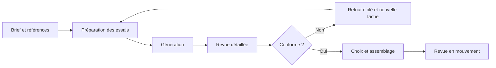

# Porcelaine en mouvement

## Carnet d’un projet personnel d’animation assistée par IA

**Projet personnel de Bakann Dy.** Transformer les poses d’un court extrait d’animation en images de poupées de porcelaine, puis les assembler en respectant les gestes, les costumes et le rythme de la source.

J’essaie de comprendre comment obtenir une suite d’images cohérentes avec des outils génératifs : quelles références fournir, comment repérer les erreurs et comment réutiliser les éléments qui fonctionnent. Ce carnet rassemble les essais, les difficultés rencontrées et l’organisation du travail.

**Statut au 7 octobre 2026 :** un premier passage pilote validé par Bakann, constitué de 11 dessins et monté à 24 images par seconde ; une image de référence validée pour un second passage, dont la production reste en cours. Le film complet n’est pas terminé.

### Lire en cinq minutes

1. [Le projet et son état d’avancement](docs/PROJET_ET_ROLE.md)
2. [Trois problèmes et les décisions prises](docs/CAS_CONCRETS.md)
3. [Les questions explorées par les essais](docs/EXPERIMENTATIONS.md)

[English overview](docs/ENGLISH_OVERVIEW.md)

### Le processus de travail

Le contrôle porte autant sur les raccords et les gestes que sur la matière. Un résultat agréable à regarder peut encore être rejeté s’il change un élément imposé.

### Comment je travaille

- Définir et préciser le résultat attendu, les gestes et les références à utiliser.
- Examiner les candidats, identifier les défauts et demander des corrections ciblées.
- Choisir les variantes et valider les images puis le passage animé.
- Suivre la progression et faire documenter les décisions, les limites et les sorties.

Claude et Codex ont réalisé une grande partie de la préparation technique, des scripts, des générations et des assemblages sous mes instructions. Cette collaboration est [explicitée dans les crédits](CREDITS.md).

### Explorer le dossier

| Ressource | Contenu |
| --- | --- |
| [Processus détaillé](docs/PROCESSUS.md) | Du brief au passage animé, avec les rôles et les points de contrôle |
| [Contrôle qualité](docs/CONTROLE_QUALITE.md) | Critères de conformité et formulation des retours |
| [Cas concrets](docs/CAS_CONCRETS.md) | Mains, costumes et dessins tenus |
| [Organisation de production](docs/ORGANISATION.md) | Fichiers, statuts, versions et limites de coût |
| [Exemples de tableaux](examples/README.md) | Suivi de lots, retours, références et exposition fictifs |
| [Revue de publication](docs/PUBLICATION.md) | Périmètre public et limites de la documentation |

### Périmètre public

Le dépôt contient une documentation adaptée et des tableaux fictifs. Les vidéos, sons, références et rendus reprenant une œuvre tierce restent exclus de cette publication. Les schémas illustrent les étapes et les rôles du processus.

Aucun modèle ni environnement de calcul n’est distribué. La documentation et les exemples sont sous [licence MIT](LICENSE).
