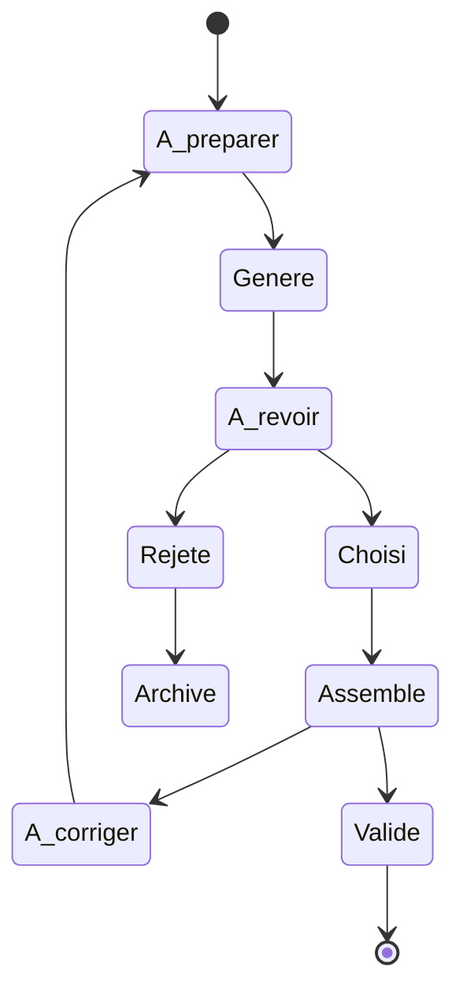

# Organiser les lots les versions et les reprises

## Les statuts utilisés dans la documentation

Un candidat généré, une pièce choisie, une image assemblée et une séquence validée représentent des états différents. Les confondre conduit à annoncer un résultat trop tôt ou à réutiliser une mauvaise référence.



Ce schéma simplifie les états observés.

## Références et versions

- Conserver les sorties brutes sous des noms distincts.
- Identifier explicitement la variante active et la personne qui l’a choisie.
- Garder les versions rejetées comme archives, sans les remettre dans la liste des références utilisables.
- Relier le résultat final à ses références et à l’assemblage réalisé.
- Conserver les empreintes des fichiers pour éviter les substitutions silencieuses.

L’archivage Git et les manifestes du projet ont été préparés avec les assistants. Mon rôle est de faire préciser les choix et de contrôler ce qui est déclaré retenu.

## Limiter les reprises

Un essai peut imposer deux ou trois appels, sans relance automatique. À son terme, présenter les défauts et décider de la suite. Quand la même erreur revient, une nouvelle consigne plus longue n’est pas toujours productive : il faut reconsidérer les références, la préparation ou l’étendue de la retouche.

Les raccords de bras, les mains et les retouches successives ont demandé beaucoup d’attention dans ce projet. Je cherche à mieux suivre le nombre d’essais et le temps consacré aux revues.

## Coût et charge de travail

Les téléchargements volumineux et dépenses ont été soumis à mon accord. Des essais ont utilisé le calcul local et d’autres l’outil intégré de génération. Les bilans conservés ne donnent pas un coût complet par image accepté : ils ne comptent pas de façon homogène le temps de préparation, de revue et de reprise.

Le temps de génération seul ne décrit pas toute la durée du travail. Les modèles de [tableaux publics](../examples/README.md) proposent des champs de durée et de limite d’appels pour structurer un futur suivi ; leurs données sont fictives.

## Organisation indicative des fichiers

```text
brief/          exigences et contraintes
references/     apparence et pièces retenues
inputs/         entrées des essais
candidates/     sorties brutes
reviews/        observations décisions et corrections
final/          images assemblées et montage
manifests/      références paramètres et empreintes
```

Cette arborescence est une présentation générique des rôles des fichiers. Le présent dépôt ne contient pas ces médias et ne recrée pas l’environnement de production privé.
