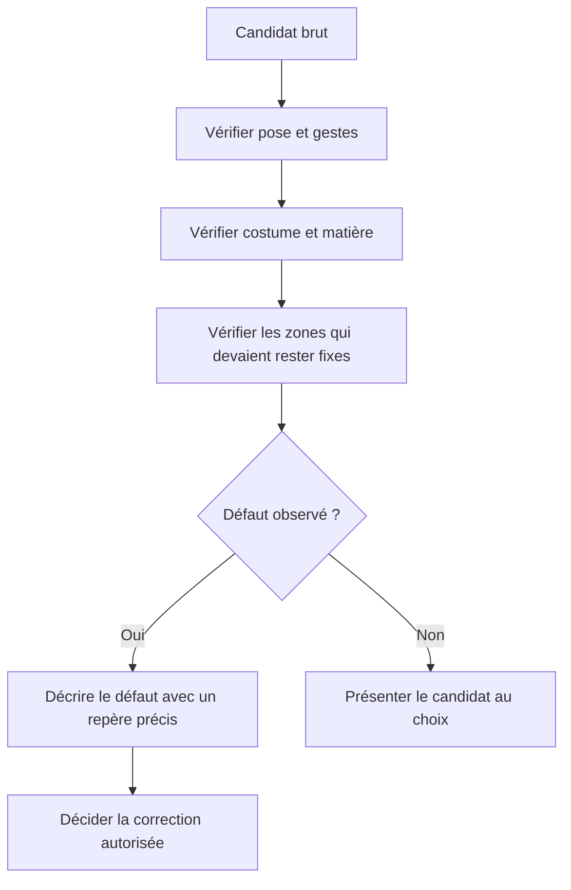
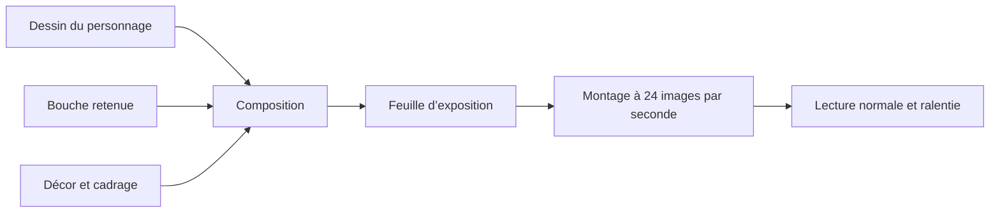
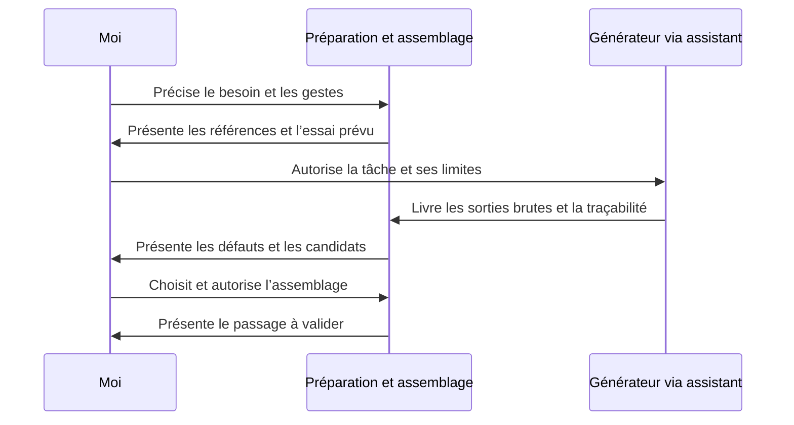

# Du brief aux images retenues

## 1 Décrire le résultat et les contraintes

Le brief précise le sujet, la source, l’apparence recherchée, les gestes, le cadrage, la cadence et les sorties attendues. Il distingue les éléments fixes des éléments qui changent. Un costume ou un visage déjà choisi sert de référence pour les essais suivants.

Chaque image fournie à un générateur a un rôle explicite : l’une montre la pose, une autre la matière, une troisième un détail de main. Une référence de couleur ne doit pas imposer la mauvaise pose.

Dans ce projet, les consignes décrivent aussi le format attendu, les références utilisables, le nombre de variantes et le point d’arrêt de chaque essai.

## 2 Préparer et limiter un essai

La préparation rassemble les références utiles, vérifie le cadrage et construit les entrées nécessaires. Claude a réalisé une grande partie de cette préparation avec des scripts et des assemblages locaux.

La tâche transmise à Codex précisait régulièrement un nombre fixe d’appels indépendants, des fichiers de sortie neufs et l’interdiction de relancer ou de retoucher les candidats bruts. Cette limite permettait de comparer les résultats réellement produits, sans effacer les échecs.

Un fichier existant validé n’était pas remplacé par une nouvelle proposition. Les tâches précisaient aussi le périmètre d’écriture et le passage de relais entre les assistants.

## 3 Générer et enregistrer

Les sorties sont conservées avec leurs références et leurs consignes. Les manifestes gardent les heures UTC, les dimensions, les empreintes SHA-256 et les refus éventuels. Une empreinte identifie un fichier ; elle ne prouve pas la justesse de son contenu.

Un refus compte comme tentative lorsqu’aucune relance n’est autorisée. Il ne doit pas être transformé en succès dans le bilan. Les conditions d’un test de comparaison doivent rester visibles : des entrées ou des réglages différents limitent les conclusions.

## 4 Revoir les détails

La revue compare chaque candidat à la source et à l’apparence choisie. Les points critiques se regardent en pleine résolution : doigts, insertion des membres, costume, bijoux, position des mains et cadrage.

Un contrôle sur une petite vignette a parfois jugé une main correcte alors qu’un gros plan montrait des doigts dédoublés. Cela a conduit à renforcer la revue à pleine résolution avant de retenir une variante.

## 5 Choisir et corriger

Je choisis les images ou pièces à garder. Les variantes rejetées restent identifiées comme telles. Le retour décrit le défaut, son emplacement, la correction attendue et les éléments à préserver.

Lors d’un assemblage autorisé, Claude a repris des zones de la référence validée pour préserver le visage, les cheveux ou le costume. Le candidat pouvait ne fournir qu’un raccord ou une main. Une génération ne devenait donc pas nécessairement l’image finale entière.

Les zones où une ancienne pièce disparaissait devaient être reconstruites correctement : fond, tissu, cheveux ou corps. Certains collages ont échoué sur ces raccords ; ils ont nécessité des corrections supplémentaires.

## 6 Voir le passage en mouvement

Le montage emploie la feuille d’exposition : elle indique quel dessin apparaît à chaque image de sortie. Une pose tenue est répétée ; les bouches peuvent changer séparément.

La lecture normale sert à juger le passage. Le ralenti et les gros plans aident à localiser les sauts, les variations de visage et les raccords. La validation d’une image seule ne vaut pas validation du passage animé.

## 7 Documenter le relais

Un relais donne une tâche précise, les références retenues, les sorties produites, les problèmes restants et le point d’arrêt. Il doit éviter qu’un assistant reprenne une variante rejetée ou modifie une zone déjà validée.

Le schéma représente les rôles du projet personnel.
